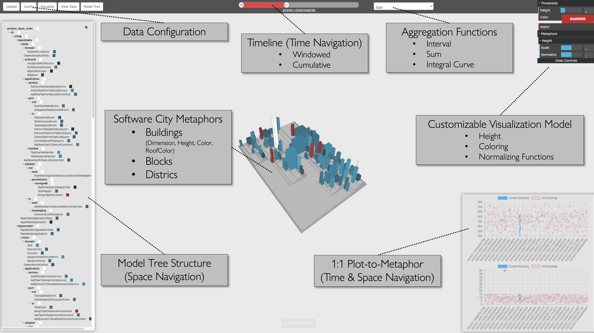

# Week 27

* I have worked on the Normalizer class. There was an issue that when sliding the normalizing bar in the gui, the buildings got negative values, resulting in buidings going into the ground. This issue is now fixed, but I need to adjust the Normalizer a little bit such that the functionality for normalizingHeight() is working as expected. I think this will take me about 1 hour to come up with a good logic.
* There was an issue that when the user only provides a data file that creates one building. Now it is fixed, that no exception occures and the model gets created correctly.
* Fixed another issue that resulted in an exception. When providing data with timestamps that are not exactly the same length, the model could not been created due to a bug in comparing strings with integers. Now it works correctly.
* I have created a python script that lets you create gaussian distributed numbers, which is nice for generating a sample data file. (Just utility for development)
* Adjustments of min-max range of dimension and height metaphor.
* On Monday afternoon I have worked on creating some slides that present the current project. You can find the slides [here](poster-slides.pptx).

## ToDo's
- [ ] Talk to Thierry whether the MVC version or the standard version without a specific patter would be better.
- [ ] Work on the Normalizer
- [ ] Remove all UI functionality that is not beeing used, e.g. City Dimension / City Spread, different kinds of data types (there is only one now)
- [ ] Polish everything up.
- [ ] Refactor code